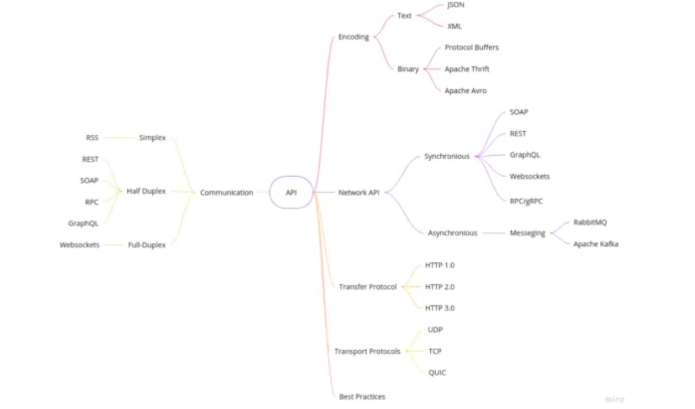
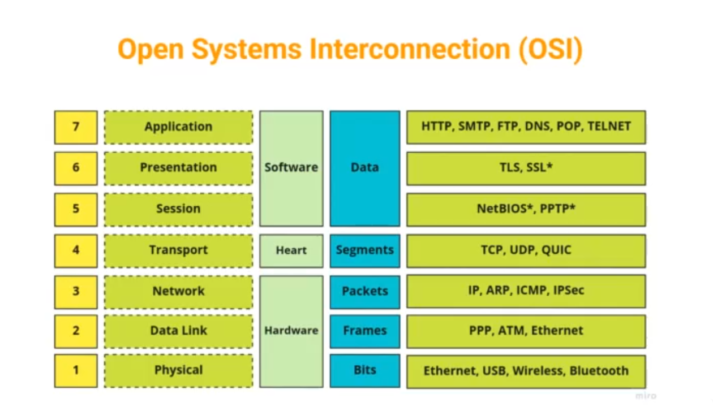
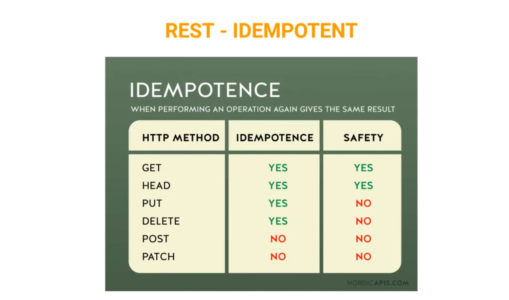

# API Design Lesson
O'Reilly's "API Styles Fundamentals"
Dec. 6, 2022

GitHub: https://github.com/ldynia/workshop-api-styles-fundamentals

---

## What's an API?
Interface between systems.
Can include 'translation' of data (i.e., to help two otherwise incompatible systems talk), and can also work as its own microservice (e.g., Kafka moves data, but also stores it and organises it).

---

## Open System Interconnection (OSI)
Originally published in the 80s, a specification guide for standard protocols for intercommunication of systems.

Communication styles:
- **Simplex** - only one device can send messages. The other can only receive.
- **Half-Duplex** - Kind of like walkie-talkies. Both sides can send and receive, but only one-at-a-time
- **Full Duplex** - Like modern phones- both sides can talk at both times.

Communication protocols:
- **Synchronous** - More efficient in most cases, but requires both sides to be online at the same time
- **Asynchronous** - Can introduce issues around race conditions,etc. but can have performance boosts

> Use Synchronous protocols unless you know you need asynchronous

---

## Protocols

### Universal Datagram Protocol
Built on top of Internet Protocol. Faster than TCP, but doesn't offer any guarantees if packages will arriee

### Transfer Control Protocol
Built on top of Internet Protocol. Slower than UDP, but offers more security and protections around your data actually arriving.

### Quic UDP
Designed to have the speed of UDP, but the security of TCP

### HTTP

**HTTP 1.1**
- Original version
- Still used by Craigslist

**HTTP/2**
- Currently most commonly-used version (97% of current computers)
  
**HTTP/3**
- Just standardised in June 2022. Includes QUIC. Supported by 75% of browsers currently.
- Does not exist in an unencrypted version like HTTP/2

(etc...)

---

## Encoding & Encrypting
Use text-based encoding when data needs to be human-readable or is consumed by a web browser.
Binary encoding is great when you have lots of data and latency is a huge problem.

### XML (Extensible Markup language)
HTML-like structured markup language. Can be extended arbitrarily (unlike HTML)

### JSON (Javascript Object Notation)
Nested structure with key-value pairs.

### Apache Avro
A binary format PLUS a JSON schema header that defines data types (human and computer-readable documentation accompanying binary data)

### Protocol Buffers
Designed to be smaller and faster than XML. Uses Schema definitions to standardise objects, which then have iterations (kind of like class instances)

---

## Common API styles

### Simple Object Access Protocol (SOAP)
- Has an envelope, header (optional), and a body.
- Defined using an XML dialect Web Service Description Language (WSDL)

### REpresentational State Transfer (REST)
- REST is not a protocol, but an architectural style (APIs that implement REST are "RESTful")

- REST specifies that some actions can be repeated and get the same result (indempotence) and / or are 'safe' in that they are not editing data (safety)

**REST advantages**
- Simple data formats
- works well with Javascript (unlike SOAP)
- Caching
- Stateless
- Human-readable

**REST disadvantages**
- Poor security
- Data exposure
- Lack of state

**When to use REST?**
- You are interested in decoupled systems that are adaptable to change
- You expect a lot of traffic
- Your API will be consumed by external systems you have no control over

### GraphQL
GraphQL allows you to specify a query to pull a specific piece of data from the server. This lets you be VERY specific about the information you want to get - and also allows users to get exactly what they need without specifying tons of endpoints (like would be required with REST)

**Advantages of GraphQL**
- Clients ONLY receive the data they need. Especially helpful in low-bandwidth environments (e.g., mobile devices)
- JSON objects can be retrieved and used as-is. No manipulation on client side needed.

**Disadvantages of GraphQL**
- Expensive queries. A large query can bring down a server.
- Rate limiting is harder to specify than with REST
- Caching can be difficult since each query can be different.
- Upload/download can be difficult

### WebSocket
- Real-time duplex communication
- Has very small overhead compared to HTTP

### gRPC

---

### Underlying technologies of APIs

---

### Characteristics of a good API

---