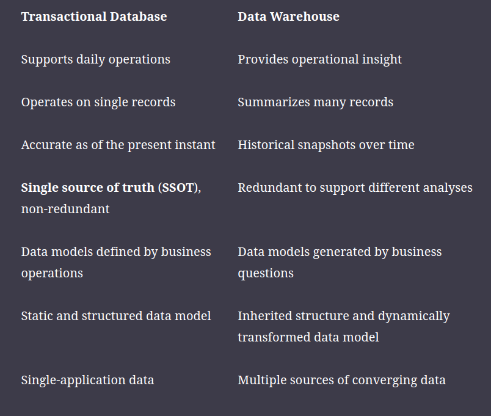
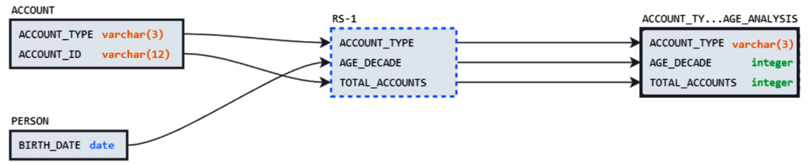
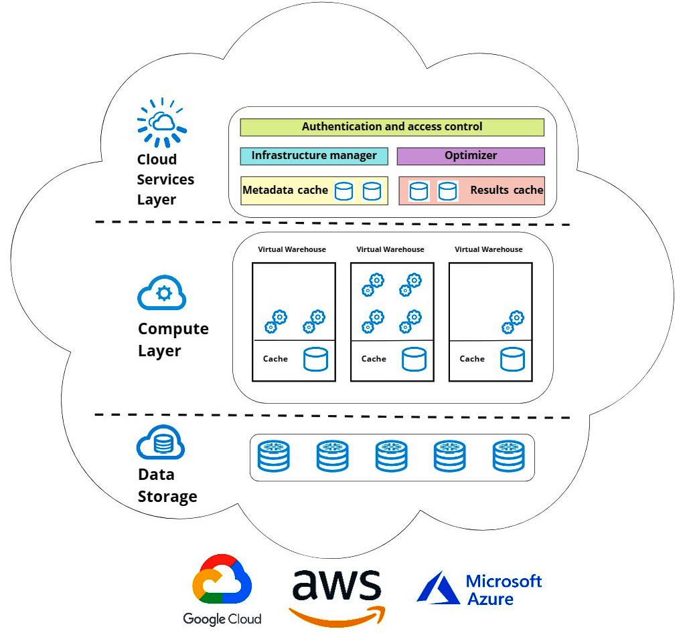

# Data Modeling with Snowflake
Authors: Serge Gershkovhich, Kent Graziano (May 2023)

The focus of this book is bridging traditional theory around data modeling with modern tooling, with a particular focus on the 'Snowflake' tool.

# Part 1: Core concepts in data modeling and Snowflake Architecture

## Ch 1.1: Unlocking power of Data Modeling

**Notes on value of data modeling**
- No matter how data is structured, it must be functionally bound to the business that it helps support. So, failing to be strict with data modeling will result in a data system which has drifted from busines needs
- A data model is not just a definition of the current shape of data (as schema-on-read systems support), but also a blueprint for how the data *should* look to support business operations. Again, failing to model data to conform to business needs ensures that data drift - and useless data - will take hold.

> **NOTE:** In this way, data modeling is not unlike application design - if you design your database systems with an understanding of the entire whole and the place where data fits and the 'layer' that it fits into, then your data system can scale and flex along with the business. As soon as you stop planning your modules, then they will start to be designed in a haphazard and short-sighted way that does not provide the foundation for future development or growth.

---

**Review of differences between OLTP and OLAP**
Online transactional processing (OLTP) is all about modeling the data needed for businesses to function - making sure logistics providers have access to customer addresses and order quantities, for example.
For OLTP, **modeling the data as close to the real-world relationships as possible is advantageous** (e.g., prices are bound to items, items are bound to collections, collections are bound to brands, etc.)

Online analytical processing (OLAP) is all about enabling decisions to be made with data. For that to work, we need to translate OLTP data into another format which makes it more understandable for business decisions (e.g., packaging market, customer segment, pricing and item information together in a data model - this is a bit of a frankenstein model, but packaging these things together allows many questions to be answered. It's all about answering as many questions as possible with data structures which are simple and easy to maintain).

**Differences between OLTP and OLAP (Data warehouses)**

---

**Data Modeling in Analytical Systems**
Analytical tables are built on top of transactional tables. Whereas transactional tables are built to closely follow the real-world operations of the business, analytical tables are built to answer (sometimes one-off) business questions.
As a result, analytical tables are often disconnected from a clear logic of what questions they answer - *so long as this logic is not sufficiently documented*.

There are multiple intersecting ways to solve this issue. The first is through literal written documentation - finding a place in your systems to write down the questions which are answered with a particular table, and how analytical tables were made.

Another way is somewhat more automatic in that as long as the tables are created in a smart system (like Snowflake, dbt), then a lineage graph can be built like the one below. This unpacks your SQL to show how data from various tables is used to create analytical tables.
> **NOTE:** There's nothing particularly magical about lineage graphs - an engineer could deduce these relationships also from looking at the SQL themselves. The automatic creation of these graphs though limit the cognitive load demanded to understand the analytical architecture.

---

**Chapter conclusions**
- There is no escaping modeling. Even if we don't need it necessarily for technical reasons (i.e., with schema-on-read and the availability of computing power, we don't **have** to be shy about being less efficient with table management), we **do need modeling for keeping our systems maintainable**. This is the same idea with software engineering - we don't have to make our modules nicely-designed for technical reasons, but if we don't, then our modules will be unmaintainable.

---

## Ch 1.2: Introduction to the 4 Modeling Types

### Conceptual Modeling
Definition: The process of mapping the entities (person, object, event or concept related to the business) of a business operation.

This is a collaborative process between the business and data teams to generate shared understanding (typically via unambiguous visual artifacts like diagrams) of the requirements that both fit business needs and are able to be implemented technically.

Entity-relationship diagrams can be a nice visual artifact for this process. ERDs answer questions about entity relationships that are qualitative (entity A has a / is a / attends entity B) and quantitative (e.g., entity A has 0 or 1 of entity B).

- **Entity Granularity** is what a single instance of an entity represents (e.g., a student, a transaction)
- **Relationship Granularity** is the granularity *between* entities, which relates to 2 dimensions:
  - **Cardinality** is the maximum number of instances that 2 entities can share (e.g., in an ERD, this is denoted by '1', or 'many)
  - **Optionality** is whether an entity *must*, or *can* have a certain relationship. Sometimes optionality is conveyed by adding '0' to cardinality (e.g., entity A can 0 or 1 of entity B) or providing a cardinality range (e.g., entity C can have 1 or many of entity D, but cannot have less than 1).

---

### Logical Modeling
Logical modeling is the formalization of conceptual modeling into a technical (or even machine-readable) format.
After a conceptual model is agreed-upon verbally in a workshop or discussion session, it's helpful to format it in a way which clearly denotes the agreed-upon details. This is generally an ERD.

The logical modeling *doesn't have* to be a separate step from the conceptual modeling, but given that conceptual modeling involves business users, leaving the technical diagrams out of the conversation and just using plain language is arguably a better approach. After that conversation is finished, the agreed-upon details can be translated into a logical model which is easily shareable within the data team.

Note that logical modeling can and should include details like data types and formats, but it should **not** include aspects specific to any one implementation (e.g., not specific to any particular database).

> **Note about Many-to-many entity relationships:**
> 
> M:M relationships are difficult because there is no way to store information in a physical database without duplicating data in both tables.
> For example: Entity S represents students and has a M:M relationship with Entity B which represents food allergies. Students can have many food allergies (or none) and the same food allergies can affect multiple students.
> 
> To represent this in a physical database, **we need an intermediate table**.
> In this example, we can have an **associative table** "Entity X" which lists students and their food allergies (students with multiple food allergies are given one row per allergy).
> 
> With this associative table, Entity S has a 0-to-many relationship with Entity X (each student can have 0 or many food allergies) and Entity X has a many-to-1 relationship with Entity A (each student-allergy association in table X is connected to at most 1 allergy in the allergy list of Entity A)

---

### Physical Modeling
Physical modeling is a blueprint for deploying data structures to a particular environment (e.g., a database system such as Snowflake or Postgres).

This conversion is largely syntactic (e.g., defining CREATE TABLE statements) and semantic (using the term NUMERIC(20,2) to describe "possibly large number with decimals (2 decimal points))

---

### Transformational Modeling
Transformational modeling is the creation of new entities based on the transformation of existing ones. **Views** or `CREATE TABLE AS...` (CTAs) statements, for example, are transformational entities which transform existing information sourced from other tables.

Transformational modeling is rarely performed in transactional databases since transformation is already a part of existing infrastructure and all necessary tables have already been created for the business to function. In other words, transformational models are used to answer questions which are *built on* existing base infrastructure and are therefore typically *supplemental* rather than *foundational* resources.

Transformational modeling also includes the `MERGE` and `INSERT` operations which keep OLAP databases up-to-date with the newest information from their OLTP counterparts.
> **NOTE:** In this sense, basically all OLAP tables can be seen as transformational, since they are all created from OLTP information originally

In documentation, the best representation of transformational modeling is the SQL used to create the entities (much like the best documentation to represent how code works - is the code itself)

---

## Ch 1.3: Mastering Snowflake's Architecture

### Traditional Database Architectures
Traditionally, databases operated on a single on-premise machine. As such, scalability was a constant issue (since there is only so much vertical scaling a machine can do) - as well as the finances of purchasing powerful on-prem machines.

Networked services alleviate this by allowing users to rent centralized machines that can scale on a temporary and/or unexpected basis.

**Types of Networked Services**

1. **Shared Disk architecture**
   Shared-disk architecture works by treating the disk as a resource separate from the machine. A single disk (single source of truth) is then networked between multiple CPUs to allow those individual CPUs to each perform read/write operations independently and concurrently.
   However, this architecture inevitably creates a bottleneck in disk access - since the disk cannot serve more than one request at a time.
2. **Shared Nothing architecture**
   Shared-nothing architecture treats each machine as a piece of the data system and just uses a network to interconnect them (distributed database). This is the basis for all cloud computing (horizontal scaling).
   However, these systems have some data replication and so do require instances to update each other, which can cause the network itself to become a bottleneck.

### Snowflake's Architecture
> NOTE: This book is basically an advertisement for Snowflake so keep some healthy doubt of how wonderful Snowflake is.

Snowflake's architecture is comprised of 3 pieces: **storage**, **compute**, and **cloud services**.

---

#### Storage layer
Snowflake completely isolates its storage - and handles a lot of the management aspects such as encryption, compression, and partitioning - as part of the service.

---

#### Compute (a.k.a. Virtual Warehouse) layer
This is a cluster of virtually-provisioned CPUs that can run your jobs (vaguely Kubernetes-like, I guess). This compute cluster seems to exclusively handle queries.

> NOTE: It is clever that the computing happens via a scalable cluster of machines, but I don't really see how this is different from a shared-disk architecture so far.

---

#### Cloud Services layer
The cloud services layer is basically the interface with the user - as well as offering some utilities such as query optimisation, access control, data sharing, etc.

> QUESTION: At this point, Snowflake doesn't seem all that different from AWS or GCP - except that it's focused on databases solely. What is the main difference?

