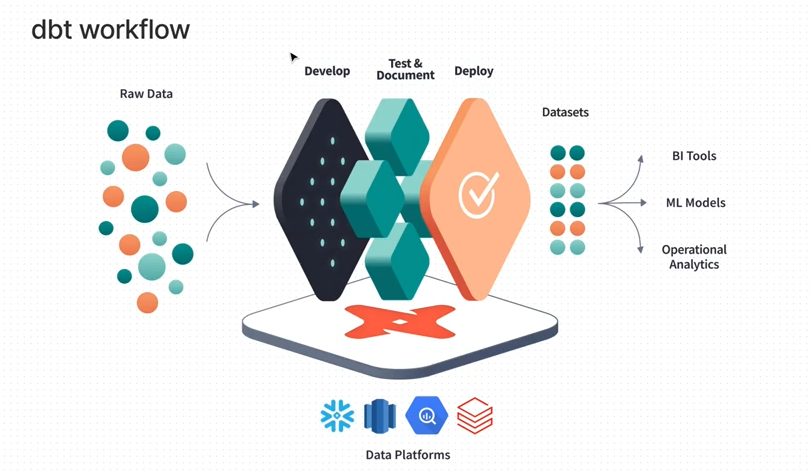

# DBT Fundamentals Course

From https://courses.getdbt.com/courses/take/fundamentals/lessons/

**Resources:**
- https://docs.getdbt.com/

---

## Where dbt fits into the data flow
dbt is for **transforming** your data once it is loaded into your data platform (e.g., Redshift, BigQuery, Snowflake).


---

## How does dbt work?
dbt is just using SQL `SELECT` queries to define transformations and the creation of new tables. dbt then uses these queries to understand the relationships and dependencies between tables - and builds a DAG for you.
You can then set up a scheduler (via most any tool I think, but also dbt cloud - the paid service) to activate the pipeline.

## dbt commands
```
#Run your data pipeline
> dbt run

#Run the tests you've defined for your data pipeline
> dbt test

#Run AND Test:
> dbt build

#Generate dbt documentation page:
> dbt docs generate

#Run ONLY a specific model again (avoids rebuilding an entire warehouse):
> dbt run --select my_model_name
```

---

## Setting up dbt
dbt requires a connection to an existing data warehouse you own. For production builds this should probably be a cloud-based service like Redshift or BigQuery and dbt offers [custom help for setting up those connections](https://docs.getdbt.com/docs/supported-data-platforms).

For just fiddling about locally however, we can also set up a connection to a local postgres instance. [Here are the steps to setting up dbt with postgres](https://docs.getdbt.com/reference/warehouse-setups/postgres-setup).

For just a basic test setup, I would configure my `~/.dbt/profiles.yml` file like this:
```
test_proj:
  target: dev
  outputs:
    dev:
      type: postgres
      host: 127.0.0.1
      user: "postgres"
      password: "postgres"
      port: 5432
      dbname: "dbt_practice" # or database instead of dbname
      threads: 1
      schema: demo
      keepalives_idle: 0 # default 0, indicating the system default. See below
      connect_timeout: 10 # default 10 seconds
      retries: 1  # default 1 retry on error/timeout when opening connections
```

## Setting up a model
By creating SQL select files in the 'models' folder of our dbt project, we can create new tables and views in our data warehouse.

By default, any SQL SELECT file that we put in our model page. creates a **view**:
```
--This creates a view:
SELECT
    SPLIT_PART(statezip,' ',1) AS state
    ,SPLIT_PART(statezip,' ',2) AS zipcode
    ,country
FROM house_prices
```

If we want to instead create a **table**, then we need to add a **config:**:
```
{{
    config(
        materialized='table'
    )
}}

SELECT
    SPLIT_PART(statezip,' ',1) AS state
    ,SPLIT_PART(statezip,' ',2) AS zipcode
    ,country
FROM house_prices
```

---

## Why so many CTEs in dbt?
This training on dbt - and much of their documentation - relies on using common table expressions a lot.
This is not necessary, but the dbt team pushes this style of writing SQL for readability.
Read more here: https://discourse.getdbt.com/t/why-the-fishtown-sql-style-guide-uses-so-many-ctes/1091

---

## Tips for data warehousing:
dbt recommends the following steps for dividing up your tables:

1. Load in source data
   1. The source data has to be present before dbt can work - this can be done with data-loading tools like Fivetran or Stitch, or a custom data-loading application or script that we own
2. Make staging tables
   1. It's a convenient first practice to make your first tables as basically 1:1 copies of the source tables. This allows for some basic renaming or basic transformations (don't do too much) and more importantly **creates flexibility if source data references need to change.** All of your later tables will rely on the staging tables, so if you build them in as an intermediary after your source tables, you can tweak them easily as needed.
3. Make intermediate tables
   1. Built on staging tables (not source) - these are intermediate steps to the final tables. There can be more intermediate tables based on (a) the complexity of transformations (i.e., more intermediate tables makes these transformations less monolithic) and (b) how likely it is that intermediate forms are useful to many tables (e.g., if multiple final tables use the same CTEs, maybe that should instead be a common intermediate table)
4. Make final tables
   1. By this stage, all the work is done- just make another final 'layer' that is extra-polished for your analysts. Similar to staging tables, doing less here is a good idea since analysts will have dependencies on these tables and will not as easily be able to adjust to changes (intermediate tables is where we should be dynamic).
   2. The final models will likely be fact + dimension tables (we're probably using a star or snowflake schema)