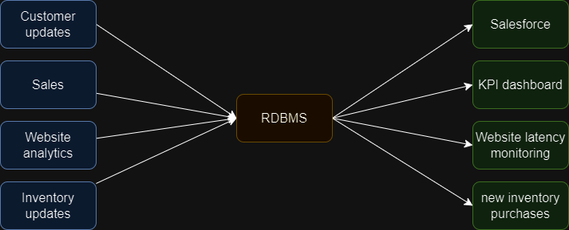
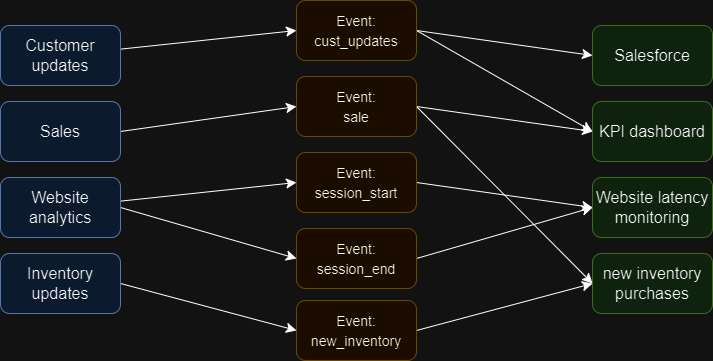

# Apache Kafka Quickstart

The following notes taken from the training hosted by Apache foundation here: https://kafka.apache.org/intro

# Notes

## Overview video Takeaways:
- Kafka (and other event brokers) encourage you to categorize the world according to 'events' instead of 'objects'. 
- Both events and objects have 'state' - one critical difference is that events are always time-specified.
- Traditional data stores such as databases don't handle event data that well
  - *Kevin's note: maybe because time is not recorded natively and even historical data sets need to have time explicitly recorded?*
- **Logs** are a better data structure to store event data - logs contain state information in a chronological sequence.
- **Apache Kafka is a way of handling this log data (a.k.a. 'topics') at scale and in a durable (persistent) way**
  - Durability in Kafka is achieved as it is for other data systems: writing to disk when possible and replicating data to protect from failure of any one machine.
- Kafka is written in Java
- Installing Kafka on a Windows machine results in a lot of errors. Hosting machine should probably be Linux (or Mac OS?)

## How Kafka enables direct, decentralized data processing
Kafka enables the lightweight transportation of small 'event data' in a way that does not require any extra middleware (besides Kafka).

This means that instead of needing to 'centralize' all data before it can be processed by downstream consumers (which can introduce bottlenecks), downstream consumers can (in theory) consume their needed data as soon as it is published in Kafka - without needing to wait on other data (batch processing).

In the images below, an example ecommerce site was previously centralizing all data in database tables before further processing. By instead storing data in a decoupled way (as events), consumers can process the data as it arrives, without needing to wait on ALL data to arrive or to extract relevant data from a larger database table with lots of irrelevant data.

**Without event-based storage:**

---

**With event-based storage:**

## Advantages of Kafka as a microservice
Kafka is an optimized message broker. If Kafka were a installable library for a programming language, we might be able to use it as a log-management service within an application.
However, Kafka is not designed to be that - rather, it is designed to be a standalone, independently-hosted service that interacts with other services over a network, rather than just on the same machine.

Kafka as an independently-hosted service decoupledhas a few advantages:
- Firstly,  a single instance of Kafka can serve multiple applications 
- Secondly, Kafka can also *share* information between applications (an asynchronous communication system)
- Thirdly, we can scale Kafka independently of other applications to work across more machines - improving latency or durability (replication) of data

## Topics in Kafka
Topics are the primary way in which Kafka organizes information. Topics can scale to hold as much event data as needed, and can be configured to have data 'expire' after a certain time - or hold that data indefinitely.

The events which exist in topics, again, represent **events**. For example:
- A sensor reports a temperature reading at a certain time
- An ecommerce site reports a purchase (along with details of the purchase) at a certain time
- A script polling the uptime of an API endpoint reports whether it received any errors at a certain time.

## What is Kafka Connect?
Kafka Connect is an interface between Kafka's event services and the external services and applications that want to publish / ingest messages to / from Kafka (a bit like an API).

Kafka Connectors are deployable plugins that can be configured without additional code to specify how data is moved between Kafka and another service.

## What is [Kafka Streams](https://kafka.apache.org/documentation/streams/)?
Kafka Stream is an API (available for Java, Scala, and possibly other languages) that allows database-like operations to be performed directly on Kafka topics, including:
- filtering Kafka events
- JOINing data from multiple event streams
- aggregating data from events

---
