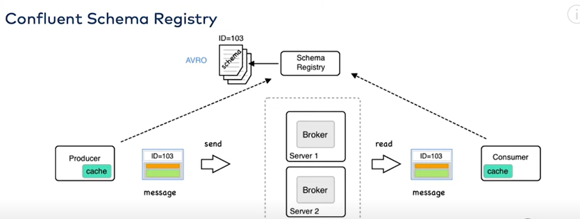
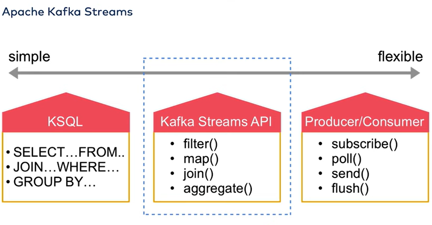

# Kafka Fundamentals Training by Confluent

You can find the full series on Youtube at this *[video link](https://www.youtube.com/watch?v=-DyWhcX3Dpc)*
Note: The introduction video just goes over the structure of the training, and so there are no notes on it here. We start with video #2 below.

---

## 2. Motivations / Use Cases for Kafka
- Kafka is coming out a larger trend of treating the world as a stream of 'events' rather than as a set of static - or at least batched - data.
- Kafka produces a *stream* of data rather than a single output like a SELECT statement from a database might provide. This requires adaptation in how we integrate this data into our applications.

**Some use cases:**
1. real-time fraud detection (batched processing might have long delays, event-driven architecture can process a single piece of data end-to-end in seconds).
2. Sensor data in airports (which can sometimes require immediate action, so rapid processing is essential)
3. eCommerce (sheer size of data requires efficient handling)
4. Online games (multiple input sources that need to interact requires decoupled and scalable processing)

---

## 3. Apache Kafka Fundamentals

### Internal Architecture

#### Brokers
Brokers are individual programs (running on different servers/containers/VMs/etc.) that have the following characteristics:
- Each broker has its own **private** local storage
- Brokers have a prespecified retention time for the data they're storing
  - *Q: Can brokers erase data independently or is there inter-broker communication necessary when a retention period ends to coordinate deletion?*
- The network of brokers together constitutes a single Kafka cluster

Brokers' main purpose is to **manage partitions** - update them with new messages from producers and provide messages to consumers.

---

#### Topics
Topics are sequences of messages that have been given a name (a topic name). Topics are set up based on developer needs.

**Other Notes:**
- The number of topics is unlimited.
- There is a many-to-many relationship between producers and topics and between topics and consumers.
- The default retention period for messages in a topic is **7 days**, but this can be configured to whatever you want.

##### Compacted Topics:
Compacted topics are an advanced way to organize topics in a smaller way.

Let's imagine that for our event data we are storing daily temperatures in cities. The key is a 'city_id' and the value is a temperature reading.

Over time, we will get messages that all have the same key because we read the temperature every day and each city always has the same city_id.

Now, let's also imagine that for our use case, *we only care about the most recent temperature*. This would mean that we can treat our log data more like a dictionary - and new events would 'update' the existing keys with the most recent temperature reading, but never add more than 1 temperature reading per city_id. This is a compacted topic..

---

#### Partitions
Topics can be **partitioned** (much in the way that databases are sometimes partitioned) to be able to scale a topic more (for greater storage or faster I/O operations).
The partitions are then distributed across the brokers in the Kafka cluster. In this way, multiple brokers can have data on a particular topic and can serve producers or consumers simultaneously.

>**NOTE:** Every partition **is a log** and as such **can only be appended to (not edited)**. The result is that each partition is strictly sequential.

Within each partition on a single broker, the partition itself is broken into smaller segment files (also includes indexes).

> **NOTE:** Retention periods for topics are actually handled on a segment level. When the newest record in a segment is older than the retention period (and therefore ALL records in that segment are older than the retention period), the segment is deleted.

>**How to partition on Kafka:** Managing partitioning on Kafka is the job of the developer. Kafka does not monitor the size of partitions, nor re-distribute partitions if they get too big or slow - these things must be managed by the developer. **NOTE:** The training video does not give hints as to how this *should* be done, but maybe we can start with best practices for database partitioning. That is: maybe we can think about partitioning based on:
> - Which dimensions of a data set are most likely to have the right cardinality (so that we naturally form relatively even partitions)
> - Which records are most likely to be used together (so that we can limit work to as few partitions as possible)

>**How producers write to the correct partition:** Without any specified partition key, Kafka employs round-robin partitioning, just cycling through the partitions sequentially and forever. With a partitioning key, the producer will **hash** the key and mod that hash by the number of partitions to produce the correct partition number: `target_partition = hash(key) % num_of_partitions`. Therefore, the same key will get written to the same partition every time (unless the developer changes the number of partitions). Custom partition algorithms can also be specified if the developer wants.

---

#### Offsets
Offsets are integers which identify the location of a particular message across all messages *for that topic*.
This is how consumers keep track of which messages they have consumed and if there are any additional messages: if the last message they consumed has the highest offset, then there are no more messages to consume. Similarly, if a consumer comes online after being offline, it can use its offset to identify where it needs to start consuming messages again.

Kafka helps consumers by storing these offsets *for each consumer* within a special topic 'consumer offsets' (for that reason, consumers do not need to store offsets persistently - they can read it from Kafka as needed).

---

#### Messages
Kafka messages consist of 4 pieces:
- Headers (optional) are similar to HTTP headers. They should not be used as additional payload, but rather as metadata (e.g., ID of the producer that sent the message).
- **Keys & values** are set entirely by the developer. There will likely be a developer-defined consistent schema for each topic.
- timestamps can be provided by the producer (if a producer knows a more accurate time). Otherwise, Kafka will auto-create a timestamp when it receives the message.

---

#### Replication
To safeguard against any single broker failing (and therefore the loss of the partitions on that broker), partitions **should be replicated**.
The replication factor can be configured at the level of the cluster (typical is 3).

When the replication factor is greater than 1, one of the replicas becomes the 'leader' and the other replica(s) become 'followers'.
When topics are producd to a partition, they are **always sent to the leader replica**. Then, it is the job of the brokers hosting the follower replicas to fetch any new messages from the leader replica as quickly as possible.
When consumers request messages, they may read from the leader OR the followers.

---

#### Zookeeper Ensemble
Kafka uses Zookeeper to manage common information between the distributed brokers, including:
- Access Control lists (who can access Kafka?)
- Failure detection and recovery for individual brokers
- Electing new 'leader replicas' when a partition hosting a leader replica fails (see 'replication' topic above)

>**IMPORTANT NOTE:** There is now a new version of Kafka that does not require Zookeeper - [read more here](https://developer.confluent.io/learn/kraft/). This apparently introduces some optimizations to recovering from unplanned shutdowns and possibly other improvements.

---

### External Architecture

---

#### Producers
Producers write event data to Kafka. This is what the developer writes, although there are prewritten APIs (and even installable user interfaces) that can make this job easier.

> **Note:** The fact that producers and consumers are decoupled (and Kafka is a buffer in-between) means that slow consumers do not affect producers, and producers and consumers can scale independently. Similarly, failure of a consumer does not affect the rest of the system.
---

#### Consumers
Consumers get data from Kafka. This is another program the developer writes, possibly also using a prewritten API / framework.
Consumers are also often producers (applications that consume, process, and produce back to Kafka are essentially forming an ETL pipeline).

> **Note:** Kafka does not send notifications. Consumers inform themselves about new data in their Kafka topics of interest because they **constantly poll Kafka for new data** (e.g., look for new data every 5 seconds). Consuming applications must be actively polling 24/7 to achieve stream processing.

---

#### Consumer Groups
By default, each consumer creates its own *consumer group* with Kafka, and, if desired, multiple consumers can be added to the same group.
This is how we can scale consumers- by sharing the same consumer group - the consumers also share the same offset, so we can ensure they are all sharing the message stream and never reading the same message twice.

> **NOTE: Consumer rebalances:** When we have multiple consumers in a consumer group, Kafka will *dynamically split messages between all consumers.* For example, if we have 4 partitions (A,B,C, and D) for a topic and 2 consumers (X and Y) in a consumer group, consumer X in that group might receive messages from partitions A and C, and consumer Y will then receive messages from partitions B and D.
> 
> If and when new consumers are added or removed to or from the group, Kafka will rebalance these partition-consumer allocations automatically.

---

### Accessing Kafka
While Kafka is written in Java (and has native Java library support), there are also wrappers for JVM languages, as well as support for non-JVM languages (e.g., Python) via modules written in C. Confluent maintains many of these libraries (e.g., `confluent-kafka` module in Python).
Kafka also ships with bash scripts to use for testing or initial setup when you can SSH into the cluster directly.

---

## 4. How Kafka works

### How Producers work
Producers must be configured with:
- Information about the cluster (e.g., IP and port)
- The topic we want to write to
- Information about data types of both message 'key' and message 'value'
  - *Q: How needed is this for Python which is dynamically typed anyway? Are these specified dynamically in `confluent-kafka`?*

With our configuration, we create the producer object (typically a class instance). We can also add optional configuration such as callback behavior (if we want any confirmation of message delivery in any particular format).

With our configured producer, we can now send messages as key-value pairs.

#### Producer Design

When a producer sends a message, it first serializes the message into a stream of bytes that it passes to a 'partitioner' service.

The partitioner then decides what partition in the Kafka topic that the message should be written to (See "Partitions" section above). The partitioner also acts as a buffer where messages are temporarily stored before they can be sent across the network to Kafka.
> **NOTE:** The producer can be configured to batch-send messages over the network to Kafka with smaller or bigger batches. There are trade-offs to latency and throughput depending on how this is configured (as is the case for any network communication).

#### Producer Acknowledgements
To ensure that messages are *actually received and stored* by Kafka, producers can be configured to wait for acknowledgement of message storage. There are 3 ways to configure this:
- **No acknowledgement**: 'fire-and-forget'; the producer sends a message and while it does still receive a TCP confirmation of delivery, it does NOT check for any acknowledgement from Kafka that the message was actually successfully saved to disk.
  - Results in **low latency** and **moderate risk of losing individual messages**.
- **Leader acknowledgement**: The producer sends a message and waits for acknowledgement from just the leader partition that the message was successfully written to disk.
  - Results in **medium latency** and **low risk of losing individual messages** (losing individual messages would mean the leader partition crashes immediately after receiving the message, before follower partitions can make copies - which happens in milliseconds)
- **All acknowledgement**: The producer sends a message and waits for acknowledgement from the leader partition and all follower partitions that all partitions have written the message to disk
  - Results in **high latency** and **extremely low risk of losing individual messages**

---

### How Consumers work
Consumers must be configured with:
- Information about the cluster (e.g., IP and port)
- The topic we want to read from
- Any custom offset (e.g., `auto.offset.reset = 'earliest'` will start reading messages from an offset of `0`, rather than the offset of the last message consumed by this consumer group - which is default behavior).

> **NOTE:** Rather than providing a string to indicate which topic to subscribe to, it's also possible to supply a *regular expression* (e.g., maybe if you have a lot of topics that all follow some consistent pattern, you can specify them like this? Maybe it's still better to store a discrete list of topics).

Consumers must be set up to continuously poll a topic in Kafka and *execute behavior continuously if messages arrive*. In a very basic form, this is just a `while True:` loop - continue polling (with some slight delay) and if messages pop in, send them somewhere else. Consumers must also be able to handle most errors from processing the stream (since continuous uptime is vital for stream processing like this), so `try...except` clauses are standard.

> **NOTE:** a function to process incoming messages would be probably best set up as `async` so that it can execute without delaying the reading of new messages.

#### Managing State in Consumers:
Many consumers might need to maintain messages they consume in memory for a certain amount of time. For example, maybe they are performing a windowed aggregation for every 20 messages.

One difficult thing to manage in this case is the possible *failure* of these consumers - and the loss of those messages in that consumer's memory. Kafka will still move the 'offset' of the consumer group onwards by default (it doesn't know that a consumer has lost messages), so re-consuming those lost messages from Kafka can be a problem.

This state management can (apparently) be solved by working with **Kafka Streams** or **kSQL DB**.

> **NOTE:** Can we also solve this in our consumer applications by being more careful about managing offset?

---

### Monitoring Kafka
Monitoring Kafka happens as for most other applications: through logging.
We can set up centralized logging system and have all our Kafka logs sent there for aggregation, visualization, and notification.

---

### Security in Kafka

#### in-transit encryption
Kafka can support the encryption of any information *in transit*, including:
- Broker-to-broker communication
- Client-to-broker communication
- Broker-to-zookeeper communication

This can at least be done with secure socket layer encryption (and possibly with other encryption systems).
This is developer-managed and must be configured manually in the cluster.

#### Authentication
Kafka also supports password-based authentication as provided by producers/consumers

#### Authorization
You can also define in Kafka which 'users' have permission to perform certain actions (e.g., consume from or produce to certain topics).

#### on-disk encryption
Kafka does **NOT** natively support encryption for messages stored on-disk. One common way to ensure security of messages is to encrypt messages *before* producing them to Kafka and then decrypt them after they are consumed.

---

## 5. Integrating Kafka into an environment

### Kafka Connect
Kafka Connect is a data-integration framework for producing and consuming to and from Kafka that is integrable with other systems (databases, flat file stores, other applications, etc.)

Kafka Connect needs to run as an independent application from Kafka - it's kind of a wrapper for Kafka from the perspective of other applications and data stores.

Kafka Connect is a *distributed* system - so it's set up to run a 'Connect Cluster' of workers. This scalable architecture translates into multiple producers and consumers to particular Kafka topics - which generally allows for parallel processing when producing to - or consuming from - Kafka. This however, is still limited by the extent to which extracting from the data source can be parallelized and the extent to which writing to the data sink can be parallelized (e.g., if there is a database lock to WRITE to our data sink, maybe we can't parallelize our consumers).

Another advantage of Kafka Connect is that it is built to manage state in the case of failure - so the failure of a particular worker that had a few messages in memory doesn't have to mean the loss of those messages (see "Managing State in Consumers" header above).

There are a set of 'connectors' usable with Kafka Connect that are already written to bring data from data sources into Kafka and from Kafka to data sinks.

---

### Confluent REST Proxy
The Confluent REST proxy is an alternative to Kafka Connect which offers a REST API to access the Kafka cluster

---

### Managing Topic Schemas
As topics exist over time, there will likely come a time when the data structure for the topic needs to change. Ensuring that producers and consumers expect - and can process - the same schema is critical.

This generally requires the maintenance of a schema registry system - which at least enforces some rules about how schemas can change (e.g., our keys must remain the same format, but by using extensible JSON or XML for our values, we can *grow* our value schemas with more information over time).

Confluent offers its own solution to this problem with its own Schema Registry - which connects to producers and consumers at runtime to ensure that schemas are acceptable by both producers and consumers:

>**IDEA:** We could also consider providing schema details in the 'headers' of each message, so that consumers could know how to interpret each message. Since these are message-bound, this wouldn't require an external registry.

---

### Confluent ksqlDB
ksqlDB is a streaming database for Apache Kafka that is owned and maintained by Confluent. It runs Kafka Streams in the background and allows you to use SQL, a CLI, or a GUI to interact with the Kafka cluster.

---

### Kafka Streams
Kafka streams is a Java API for performing stream processing with Kafka data. It runs natively from Kafka - so Java-based consumers can use it as a library without the need for another service.

---

END